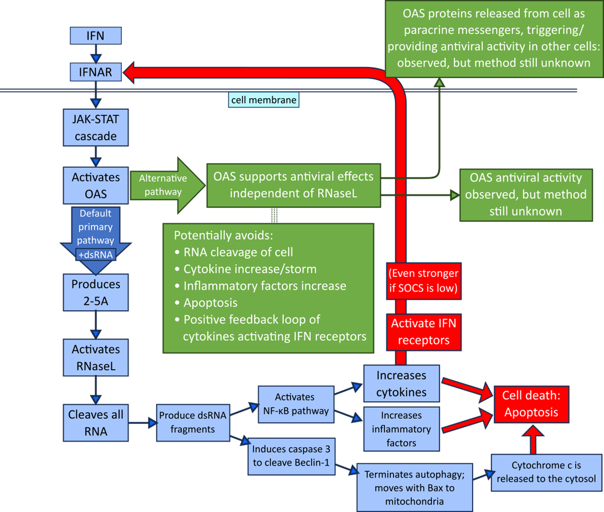

# Phase 3 – Literature research

This research addresses the knowledge gap in the pathophysiology of asthma by investigating DGE of four genes and extensively researching their pathways and functions. Despite copious research and high global asthma, they aren’t yet associated with asthma, so were expected to be unimportant and minimally expressed. Surprisingly, they’re critical in cellular immune response & survival and antiviral function, and are expressed in practically every cell as part of the innate cellular defence. Finding them as critical components of the JAK-STAT cascade, it seemed that they might appear in other pathways; but they seemingly do not.

These genes could play roles in the asthmatic inflammatory response, including STAT1 and OASL: the patterns of significant DGE of all six genes were of an approximately equal proportion greater in asthmatic than in non‑asthmatic tissues (_Fig. 2_). This strengthens the possibility that an upstream component is increasing gene expression by exacerbating the regular antiviral response, because if the asthmatic-donor genes were polymorphic, their differential expressions might be independent of each other.

It’s clear these genes are significantly more expressed in asthmatic than non‑asthmatic tissue under HRV16 challenge; despite unknown causes, these genes & their products are potential targets for asthma intervention. Such therapeutic targeting is being researched, including halting cancer with SAHA preventing IFNγ activation of JAK‐STAT (Zhang _et al._, 2013) (details in _Discussion: Targets for therapeutic prevention_), and slowing, stopping and even reversing retinal degradation blindness by delivering a corrected gene to the retinal pigment & photoreceptor eye cells with a virus vector, AAV2‑REP1 (Ong _et al._, 2019).

The statistical analysis results are in accordance with the literature as most prior research shows these genes in antiviral defence; and the experimental assailant in this study was a virus. However, the results also go beyond the literature because there isn’t any research regarding DGE of these specific genes in asthmatics.

&#x20;

## Differential expression causes

For DGE to occur, there are two main possibilities. Having provisionally ruled out genetic polymorphisms, focus moves to DGE being a secondary effect of something else within the functional pathophysiology.

### Antiviral defence

As these genes are part of the antiviral system, they likely wouldn’t be upregulated by non-viral assailants. This is consistent with asthmatic genetic expression literature: non-viral triggers, like pollutants (diesel particles induce STAT3 (Prunicki _et al._, 2018)) and allergens (egg albumin affected 368 genes (Kim _et al._, 2020)), differentially regulate arrays of genes via various mechanisms (like DNA/RNA methylation, histone modification, ncRNAs); but in general, STAT2 and OAS family genes aren’t mentioned.

Conversely and somewhat anomalously, one study on bronchial epithelium demonstrated that ORMDL3 transfection _in vitro_ significantly upregulated OAS1,2&3; their theory at time of writing was that this OAS activation was an asthma-specific protective pathway against viral exacerbations (Miller _et al._, 2012).

Further experiments can be conducted exploring OAS behaviour, as there are relatively few genome-wide association studies (GWAS) that analyze and compare asthmatic expression under different conditions – although, recent research trends towards DNA methylation analysis and transcriptome-wide association studies (TWAS).

### Missing SOCS

Phase 2 statistical results, combined with phase 3 pathways research, suggests that OAS genes were upregulated by increased STAT1/2 activation of the JAK‑STAT pathway, implying their expression is influenced either by STAT, or something else upstream during antiviral response. One upstream cause is cytokines (expression data available in source dataset, not analyzed in this study), so this could be a positive feedback loop or even a cytokine storm. SOCS proteins (suppressors of cytokine signalling) negatively regulate cytokine, keeping JAK-STAT activity in check (Low _et al._, 2022): it's possible that SOCS protein dysregulation allowed excessive cytokine signalling, increasing STAT & OAS expression.

Indeed, this is corroborated by a study on SOCS gene expression in asthmatic bronchial epithelial cells, demonstrating negative correlation between SOCS1 presence and asthma severity (Doran _et al._, 2016).

Despite each OAS type having different specificity to viral RNAs and cellular localizations, all were upregulated in response to HRV16 and inside the same HAECs. This was unexpected and isn’t presently understood.

&#x20;

## Targets for therapeutic intervention 

Regardless of the source, STAT2 and the OASes provide opportunity for intervention. Inhibitors could be used to modify and fine-tune their responses to IFNs: STATs present several targets.

### STAT targets

**Inhibition of STAT by protein inhibitors of activated STAT (PIAS) proteins** prevents DNA binding and causes degradation by sumoylation (Mitchell and John, 2005).

**Decreasing STAT activity by upregulating SOCS proteins** could reduce severity of asthmatic inflammatory response by suppressing cytokine signalling, which activates STAT. Current research explores SOCS inhibitors as COVID‑19 therapy, because certain viruses upregulate SOCS to evade the innate response, increasing their ability to replicate (Low _et al._, 2022). Thus, this approach seems risky; but previous research showed low SOCS expression in asthmatics (Doran _et al._, 2016) so upregulation could reduce the asthmatic response.

**Disabling STAT’s transcription functions via histone deacetylase (HDAC) inhibitors (HDIs)**, such as trichostatin A and SAHA (Mitchell and John, 2005), would interfere with OAS activation. SAHA (suberoylanilide hydroxamic acid, _Vorinostat_) is used medically for inducing apoptosis, stalling cancerous growth by binding to the HDACs active site. After its approval in 2006, a trial on human gallbladder carcinoma (epithelial tissue cancer) showed it blocks IFNγ activities, preventing STAT1 phosphorylation and translocation into the nucleus (Zhang _et al._, 2013) – where ISGs (interferon-stimulated genes) such as OAS are transcribed.

&#x20;

### OAS targets

The RNaseL-independent antiviral ability of OAS seems useful. According to the literature, RNase can cause apoptosis via multiple pathways, primarily via RNA fragments. They are known to cause cytochrome c release into the cytosol (Siddiqui _et al._, 2015), and they trigger the NF‑κB pathway resulting in excessive cytokine and inflammatory factor production (Pai and Thomas, 2008). If such RNase activity causes excessive apoptosis under viral challenge, then reduction or suppression of RNase function could be an effective therapeutic target for diminishing or preventing premature apoptosis, thereby potentially retarding both the development of airway tissue remodelling and the worsening of the asthmatic condition.

For example, reducing RNaseL activation by downregulating OAS3 (which produces 2‑5A) or using certain viruses to degrade 2‑5A (Silverman and Weiss, 2014), and upregulating OAS1 and OAS2 (which have displayed RNaseL-independent antiviral activity (Li _et al._, 2016)) could allow asthmatic tissues to successfully defend against viral challenge without committing apoptosis. Avoiding unnecessary apoptosis helps prevent airway remodelling and proliferation of sensitized tissues that have taken on new phenotypic behaviours (e.g. via epigenetic methylation) (King _et al._, 2018).

See _Fig. 5_ below for a diagrammatic summary of the primary and alternative OAS antiviral pathways.

_**Figure 5**: Generalized pathway diagram demonstrating the potential benefits of avoiding the default OAS-RNaseL pathway._

_When the typical OAS pathway is followed, RNaseL is activated, cleaving RNA throughout the cell leading to apoptosis, and producing RNA fragments which activate the NF‑κB pathway, thereby increasing cytokine & inflammatory factor production. These too lead to apoptosis; and cytokine increase (known as a “cytokine storm” if strong enough) also produces positive feedback by activating IFNARs (IFN receptors)._

<figure><figcaption>
Figure 5: Generalized pathway diagram demonstrating the potential benefits of avoiding the default OAS-RNaseL pathway.
</figcaption></figure>

Another therapeutic target exists inside macrophages: upregulating OAS1 and OAS3 could increase their negative regulatory function, suppressing unnecessary expression of chemokines and IFN-responsive genes. However, this upregulation would oppose the aforementioned downregulation efforts for reducing RNaseL activation, so more experimentation is required to understand the trade-offs and how to specialize & localize the therapeutic alterations.
